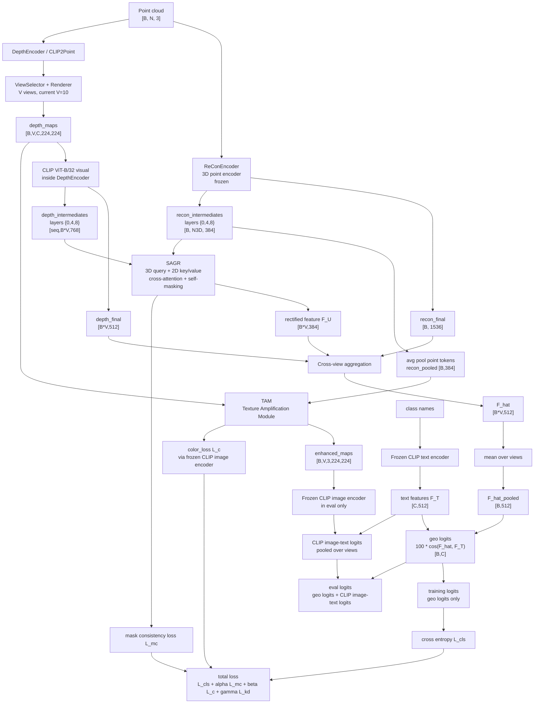
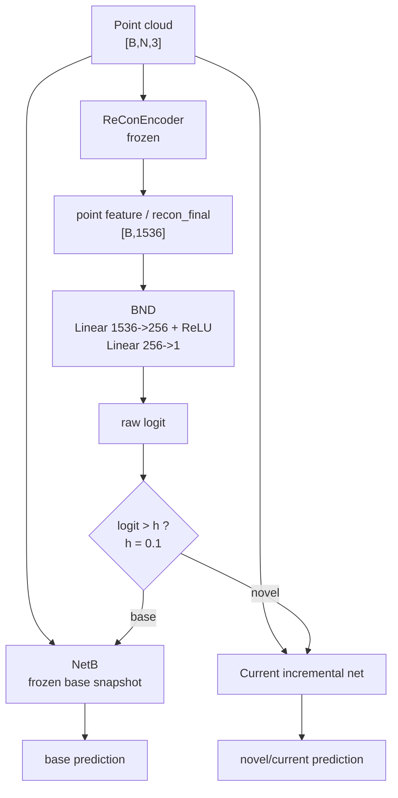

# CMGR 神经网络结构图

本文档按当前代码实现绘制，而不是只按论文示意图绘制。

关键代码入口：

- `cmgr_models/cmgr.py`
- `cmgr_models/depth_encoder.py`
- `cmgr_models/sagr.py`
- `cmgr_models/tam.py`
- `cmgr_models/bnd.py`

## 主网络前向结构

## 增量阶段 BND 路由结构

## 参数训练状态

| 模块 | Base 阶段 | Incremental 阶段 | 说明 |
|---|---|---|---|
| ReConEncoder | 冻结 | 冻结 | 3D 点云特征提取器 |
| DepthEncoder / CLIP2Point visual | 训练 | 冻结 | 当前代码增量阶段冻结它 |
| CLIPWrapper text/image | 冻结 | 冻结 | 文本特征、颜色对齐和 eval image-text logits |
| SAGR | 训练 | 训练 | 跨模态几何校正 |
| TAM | 训练 | 训练 | 学习背景颜色并增强 depth maps |
| BND | 不训练 | 每个增量任务前单独训练 | base/novel 二分类路由 |

## 当前实现里的核心维度

| 张量 | 维度 |
|---|---|
| 输入点云 | `[B, N, 3]` |
| ReCon final | `[B, 1536]` |
| ReCon intermediate | `[B, N3D, 384]` |
| Depth maps | `[B, V, C, 224, 224]` |
| 当前 V | `10` |
| Depth final | `[B*V, 512]` |
| CLIP intermediate | `[seq, B*V, 768]` |
| SAGR output `F_U` | `[B*V, 384]` |
| Aggregated `F_hat` | `[B*V, 512]` |
| View pooled `F_hat` | `[B, 512]` |
| Text features | `[C, 512]` |
| Class logits | `[B, C]` |

